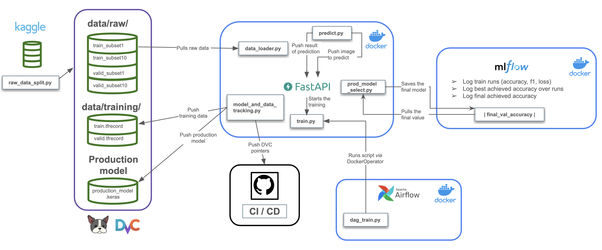
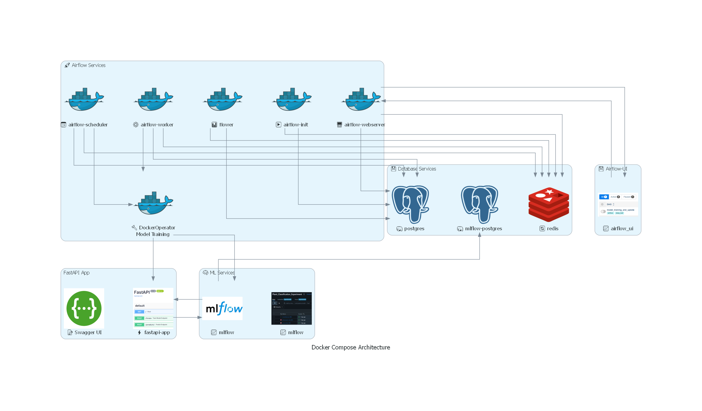
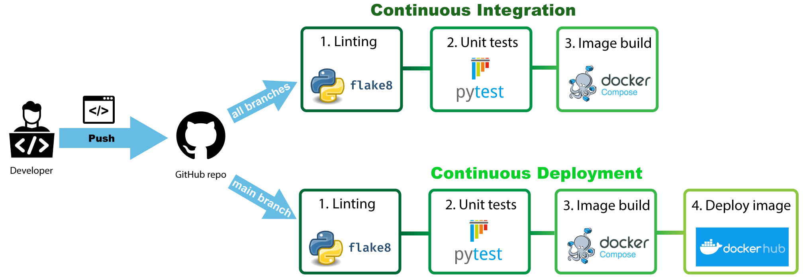

# 🌱 Deep Leaf - Plant Disease Classification MLOps Pipeline

## 📌 Overview
**Deep Leaf** is a deep learning-based **image classification pipeline** for detecting plant diseases using **Transfer Learning (VGG16)**. It follows **MLOps best practices**, enabling:
- **FastAPI access**
- **Containerization with Docker**
- **MLflow tracking**
- **Airflow orchestration**
- **CI/CD with Github Actions**


## 📂 Repository Structure

We saved all necessary files for the python runs into the folder `src/`. To use these scripts in the FastAPI (folder `app/`), we create a local package of `src` that is built during installing the requirements (`requirements.txt` or `requirements_mac.txt`). 
The `data/` is once build with the script `raw_data_split.py` and then saved into `data/raw`. Since we simulate new data by adding to the first data set the each of the other data splits (up to 10) we create two new files `train.tfrecord` and `valid.tfrecord` that are saved in `data/training/`.
In `model/`, you can find the current production model (`production_model.keras`) as well as metadata (final validation accuracy score, `metadata.txt`).
In `app/`, you find the creation of the FastAPI.
In `mlflow/`, you can find the creation of the MLflow container. 
In `tests/`, you can find simple test scripts for the unit tests.
There are some helper files:
- `setup.py`: for creation of the package `src` to reference them in `app/`
- `architecture.excalidraw`: visualization of (ongoing) workflow
- `merge_progress.json`: A file to check how far we have been so far with the new data simulation 

```plaintext
.
├── LICENSE
├── README.md
├── app
│   ├── __init__.py
│   └── main.py
├── architecture.excalidraw.png
├── data
│   ├── raw
│   │   ├── train_subset1.tfrecord
│   │   ├── ...
│   │   ├── train_subset10.tfrecord
│   │   ├── valid_subset1.tfrecord
│   │   ├── ...
│   │   └── valid_subset10.tfrecord
│   ├── test
│   │   ├── AppleCedarRust1.JPG
│   │   ├── ...
│   │   ├── AppleCedarRust4.JPG
│   │   ├── AppleScab1.JPG
│   │   ├── AppleScab2.JPG
│   │   ├── AppleScab3.JPG
│   │   ├── CornCommonRust1.JPG
│   │   ├── CornCommonRust2.JPG
│   │   ├── CornCommonRust3.JPG
│   │   ├── PotatoEarlyBlight1.JPG
│   │   ├── ...
│   │   ├── PotatoEarlyBlight5.JPG
│   │   ├── PotatoHealthy1.JPG
│   │   ├── PotatoHealthy2.JPG
│   │   ├── TomatoEarlyBlight1.JPG
│   │   ├── ...
│   │   ├── TomatoEarlyBlight6.JPG
│   │   ├── TomatoHealthy1.JPG
│   │   ├── ...
│   │   ├── TomatoHealthy4.JPG
│   │   ├── TomatoYellowCurlVirus1.JPG
│   │   ├── ...
│   │   └── TomatoYellowCurlVirus6.JPG
│   └── training
│       ├── train.tfrecord
│       └── valid.tfrecord
├── data.dvc
├── docker-compose.yaml
├── dockers
│   ├── airflow
│   │   ├── dags
│   │   │   └── dag_train.py
│   │   ├── logs
│   │   │   ├── ...
│   │   │   ├── dag_processor_manager
│   │   │   │   └── dag_processor_manager.log
│   │   │   └── scheduler
│   │   │       ├── 2025-03-20
│   │   │       │   └── dag_train.py.log
│   │   │       └── latest -> 2025-03-20
│   │   └── plugins
│   ├── fastapi
│   │   ├── Dockerfile
│   │   └── requirements.txt
│   └── mlflow
│       └── Dockerfile
├── logs
│   ├── ...
│   └── history_20250319_002320.json
├── merge_progress.json
├── mlflow
│   └── artifacts
│       └── ...
├── mlflow.dvc
├── models
│   ├── metadata.txt
│   ├── production_model.keras
│   └── production_model.keras.dvc
├── requirements.txt
├── requirements_mac.txt
├── requirements_wsl2.txt
├── setup.py
├── src
│   ├── __init__.py
│   ├── local_dagshub
│   │   ├── data_loader.py
│   │   ├── prod_model_select_mlflow_dagshub.py
│   │   └── train_mlflow_dagshub.py
│   ├── config.py
│   ├── data_loader.py
│   ├── git_dvc_update.py
│   ├── helpers.py
│   ├── model.py
│   ├── predict.py
│   ├── prod_model_select.py
│   ├── raw_data_split.py
│   ├── test_config.py
│   ├── train.py
│   ├── trials.py
│   └── utils.py
├── temp
│   ├── current_accuracy.txt
│   └── current_model.keras
└── tests
    ├── api_server.py
    └── mlflow_server.py
```

## 📈 Data
The original data stems from [Kaggle (New Plant Diseases Dataset)](https://www.kaggle.com/datasets/vipoooool/new-plant-diseases-dataset). Before the project, we downloaded the data set once, and created 10 subsets of training and validation (script `src/raw_data_split.py`), saving the subsets as `.tfrecord` for versioning and then used this 10 subsets as fictional new data income. Therefore, we will add incrementally to the first data set, the other splits to simulate new data incoming. 

## 🧑‍💻 Project Diagram



## Application Operation

### FastAPI

This project provides a FastAPI-based web API. It includes endpoints for triggering model training and performing inference (predictions) on uploaded images.

This API allows you to:
1. **Train a new model** using the latest data.
2. **Compare and promote** the newly trained model to production if it outperforms the existing one.
3. **Predict** the class of an uploaded leaf image.

The main endpoints are:

- `GET /`  
  Returns a simple welcome message to confirm the API is live.

- `POST /train`  
  Runs a **background training job** to:
  1. Load or merge new subsets of data.
  2. Train a new model.
  3. Compare the new model with the production model.
  4. If better, promote the new model and track it via DVC/Git.

- `POST /predict/`  
  Accepts an **image file** (JPG, JPEG, or PNG up to 5MB) and returns the predicted class index.

#### Usage Examples

Train:
```sh
curl -X POST http://127.0.0.1:8000/train
``` 

Predict:
```sh
curl -X POST "http://127.0.0.1:8000/predict/" \
     -F "file=@path/to/local/image.jpg"
```

### Docker

The project uses a containerized architecture with the following breakdown and features:

1. Services Implemented
- Two Postgres database services:
    - `postgres`: for Airflow to store metadata and task information
    - `mlflow-postgres`: for MLflow for tracking experiments
- Redis service for communication between Airflow scheduler and workers:
    - central communication hub for Airflow
    - `redis`: used for Airflow Celery executor as a message broker and result backend 
    -  runs on port 6379
- MLflow server for experiments and tracking:
    - mounted volumes of `mlflow` for: artifacts storage, model directory, logs and temp files
    - depends on `mlflow-postgres` for storage
    - exposes port 5001
- FastAPI-app service to run all executables of the project:
    - used to run web app services (swagger UI)
    - mounted volumes: the entire root directory
    - depends on MLflow service (in order to fetch artifacts and experiment related data)
    - exposes pot 8001 (mapped 8000 internally)
- Airflow services, consists of the standard components:
    - `airflow-webserver`: Web interface for Airflow which exposes port 8080
    - `airflow-scheduler`: Manages DAG scheduling
    - `airflow-worker`: Celery workers for distributed task execution
    - `airflow-init`: Initializes Airflow database and creates default user
    - `flower`: Celery monitoring tool which exposes port 5555

2. Comunication and Dependencies
- Airflow Components:
    - Use `redis` as a message broker and result backend
    - Communicate through `celery` for distributed task processing
    - Share common configuration via `x-airflow-common`
- MLflow and FastAPI integration:
    - Share volumes for artifacts, models, and logs
    - FastAPI depends on MLflow service
    - Both use separate PostgreSQL databases
- Database Connections:
    - Airflow uses `postgres` database
    - MLflow uses `mlflow-postgres` database
    - Both databases configured with healthchecks
- Dependencies
    - `postgres` and `redis` must be healthy for Airflow services
    - `mlflow-postgres` must be healthy for MLflow
    - `mlflow` must be running for `fastapi-app`
- Key Volumes and Mounts:
    - Shared project root (.:/app) --> and as applicable
    - Docker socket for DockerOperator in Airflow --> for DAG implementation
- Configuration:
    - Uses environment variables for flexible configuration
    - Mounted `.env` file for testing
    - Basic authentication for Airflow API
- Startup and Initialization
    - Services configured with restart policies
    - Healthchecks ensure proper startup sequence
    - Airflow initialization creates default user

3. Docker-in-Docker for model training within Airflow
- Using `fastapi-app` container for model training
- Enabling running model training as a containerized Airflow task
- Mounting the entire project repository (`.:/app`) into the container
- Using Docker socket volume (/var/run/docker.sock) for container management


Here is an overview:


### MLflow
This project integrates MLflow to track model training, log hyperparameters, and store artifacts for versioning and reproducibility.

1. Tracking and Logging

During training, MLflow logs:
- Metrics: Training loss, accuracy, F1-score, validation loss, validation accuracy, and validation F1-score for each epoch.
- Hyperparameters: Model type (VGG16), number of epochs, batch size, input shape, and number of classes.
- Artifacts: The trained model is saved using mlflow.keras.log_model() for reproducibility.

2. Experiment Setup

Before training starts, MLflow:
- Sets the tracking URI from environment variables (MLFLOW_TRACKING_URI).
- Defines an experiment name (MLFLOW_EXPERIMENT_NAME).
- Initializes default logging for hyperparameters.

3. Logging During Training

A custom callback (MLFlowLogger) logs training metrics at the end of each epoch:
- Tracks best validation accuracy and best F1-score across epochs.
- Logs final validation metrics after training.

4. Model Storage & Comparison
- The trained model is saved in MLflow’s model registry.
- The current model is stored locally (temp/current_model.keras) for comparison with previous models.

6. Reproducibility

The training history (accuracy, F1-score, loss) is saved as a JSON file, ensuring results can be analyzed later.

MLflow is set up in a container running the tracking server. We use PostgreSQL database (mlflow-postgres) as backend for tracking experiment metadata. The container stores artifacts in `/app/mflow/artifacts/` which is mounted from the host machine. Access is given via port `5001`.

### Airflow

Using a DAG to run model training for the project with the following Functionality and Features

1. DAG Configuration of `model_training_and_update`
- Scheduled run daily at 3:00 PM and one active run at a time

2. Task Details
- Task ID: train_model
- Container Configuration: 
    - Uses the fastapi-app:latest image
    - Executes python /app/src/train.py command
    - Runs with bridge network mode
    - Auto-removes container after execution

3. Additional feratures
- XCom Push: to captures stdout for logging and tracking

4. Error Handling
- Configured with 1 retry
- 5-minute delay between retries

5. General Remarks:
- Uses DockerOperator for containerized task execution
- Leverages Docker socket for container management
- Enables reproducible and isolated model training workflows

### CI/CD Pipeline with GitHub Actions

Below is a high-level overview of the Continuous Integration (CI) and Continuous Deployment (CD) pipeline, as depicted in the diagram:



---

#### Continuous Integration (CI)

**Trigger:** On every push to any branch of the GitHub repository.

**Steps:**

1. **Linting (flake8)**
   - Validate Python code style and consistency using `flake8`.
   - Catch syntax errors, unused imports, or other code-quality issues.
2. **Unit Tests (pytest)**
   - Run test suites using `pytest` to ensure code functionality and logic.
   - Generate test reports (or coverage reports) to verify application stability.
3. **Image Build (Docker Compose)**
   - Build a Docker image of the application using Docker Compose.
   - Ensure the application can be containerized successfully without errors.

Overall, if any step fails (linting, testing, or image build), the workflow is marked as failed and notifies the developer.

---

#### Continuous Deployment (CD)

**Trigger:** On every push specifically to the **main** branch of the repository.

**Steps:**

1. **Linting (flake8)**
   - Same as in CI: enforce style guidelines and code consistency.
2. **Unit Tests (pytest)**
   - Same as in CI: verify application logic through automated tests.
3. **Image Build (Docker Compose)**
   - Same Docker build process as in CI.
   - This ensures the image that will be deployed is production-ready.
4. **Deploy Image (Docker Hub)**
   - Upon successful build, the Docker image is pushed to a Docker Registry (Docker Hub).
   - Facilitates deployment to production or other environments.

Once the build is pushed to Docker Hub, downstream environments can pull the latest image automatically or on-demand.

This pipeline ensures that every code change is linted, tested, and containerized. 
Only changes on the main branch will move on to the deployment step, publishing the Docker image for use in production or further integration.
