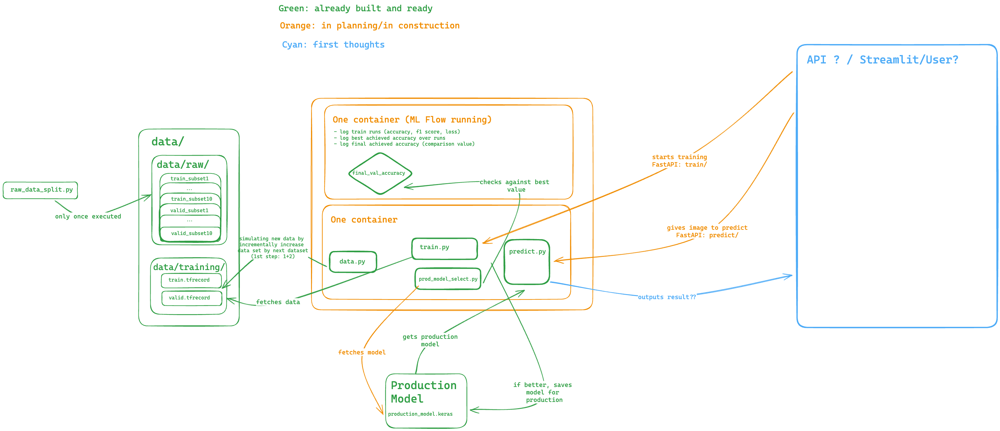

# 🌱 Deep Leaf - Plant Disease Classification MLOps Pipeline

## 📌 Overview
**Deep Leaf** is a deep learning-based **image classification pipeline** for detecting plant diseases using **Transfer Learning (VGG16)**. It follows **MLOps best practices**, enabling:
- **Airflow orchestration**
- **MLflow tracking**
- **FastAPI access**
- **CI/CD with Github**

## Context??
DO WE NEED THIS?

## 📂 Repository Structure

We saved all necessary files for the python runs into the folder `src/`. To use these scripts in the FastAPI (folder `app/`), we create a local package of `src` that is built during installing the requirements (`requirements.txt` or `requirements_mac.txt`). 
The `data/` is once build with the script `raw_data_split.py` and then saved into `data/raw`. Since we simulate new data by adding to the first data set the each of the other data splits (up to 10) we create two new files `train.tfrecord` and `valid.tfrecord` that are saved in `data/training/`.
In `model/`, you can find the current production model (`production_model.keras`) as well as metadata (final validation accuracy score, `metadata.txt`).
In `app/`, you find the creation of the FastAPI.
In `mlflow/`, you can find the creation of the MLflow container. 
In `tests/`, you can find simple test scripts for the unit tests.
There are some helper files:
- `setup.py`: for creation of the package `src` to reference them in `app/`
- `architecture.excalidraw`: visualization of (ongoing) workflow

.
├── LICENSE
├── README.md
├── app
│   ├── __init__.py
│   └── main.py
├── architecture.excalidraw
├── data
│   ├── raw
│   │   ├── train_subset1.tfrecord
│   │   ├── ...
│   │   ├── train_subset10.tfrecord
│   │   ├── valid_subset1.tfrecord
│   │   ├── ...
│   │   ├── valid_subset10.tfrecord
│   └── training
│       ├── train.tfrecord
│       └── valid.tfrecord
├── data.dvc
├── logs
│   ├── history_20250213_084609.json
│   ├── ...
│   └── history_20250310_201801.json
├── mlflow
│   ├── mlflow_data/
│   ├── mlflow_db/
│   └── Dockerfile
├── models
│   ├── metadata.txt
│   └── production_model.keras
├── production_model.keras.dvc
├── requirements.txt
├── requirements-mac.txt
├── setup.py
├── src
│   ├── __init__.py
│   ├── config.py
│   ├── helpers.py
│   ├── model.py
│   ├── predict.py
│   ├── prod_model_select.py
│   ├── raw_data_split.py
│   ├── test_config.py
│   ├── train-mlflow-dagshub.py
│   ├── train.py
│   ├── trials.py
│   └── utils.py
├── temp
│   ├── current_accuracy.txt
│   └── current_model.keras
└── tests
    ├── api_server.py
    └── mlflow_server.py

## 📈 Data
The original data stems from [Kaggle (New Plant Diseases Dataset)](https://www.kaggle.com/datasets/vipoooool/new-plant-diseases-dataset). Before the project, we downloaded the data set once, and created 10 subsets of training and validation (script `src/raw_data_split.py`), saving the subsets as `.tfrecord` for versioning and then used this 10 subsets as fictional new data income. Therefore, we will add incrementally to the first data set, the other splits to simulate new data incoming. 

## 🧑‍💻 Project Diagram

## Application Operation

**APIs :**

**Description adding at the end** 

**Dagshub :**

**Airflow :**

The admin has access to the Airflow interface, where DAGs allow regular model evaluation and training on new data.

**Streamlit :**
